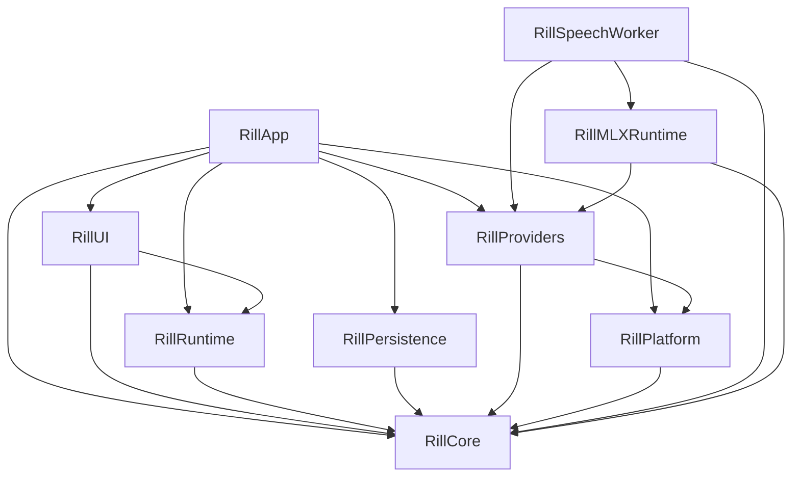

# Architecture

Rill separates domain contracts, runtime decisions, external effects, and UI
state. `Package.swift` defines the module graph; `AppBootstrap` assembles the
concrete implementations.

## Module dependencies

Arrows point from a consumer to its dependencies.

| Module | Responsibility |
| --- | --- |
| Core | Values, validation, privacy contracts, and ports such as `GlobalInputSource`, `SettingsStore`, and `RecordGraphPersistenceStore`. |
| Runtime | Session execution, authorization, Record graph commands, and resource lifetimes against Core ports. |
| Platform | macOS input, clipboard, focus, files, credentials, and other system adapters. |
| Providers | Recognition, text transformation, and output implementations. |
| Persistence | SQLite connection, schema migration, encryption, and transactional repositories. |
| UI | Observable presentation state, feature models, and SwiftUI/AppKit views. |
| App | Composition, application lifecycle, and window/controller integration. |
| MLXRuntime / SpeechWorker | Local model execution in the separate speech process. |

Runtime receives system effects through injected ports or closures. For example,
`RecordingSessionManager` owns the validity of a
`RecordingCueToken`, while App supplies the haptic effect. The adapter calls
`performIfValid` at the synchronous effect boundary, after reaching the main
actor, so cancelling a recording suppresses a cue still waiting to be played.

## State and lifetime ownership

| State | Owner | Boundary |
| --- | --- | --- |
| Records, memberships, routes, leases, and persistence revision | `RecordStore` | Commands commit before publishing catalog updates or collection events. |
| SQLite connection and transactions | `SQLitePersistenceStore` | Settings, history, and catalog extensions share one actor and connection. A transaction never suspends between statements. |
| Active recording and its cleanup | `RecordingSessionManager` | Cancellation invalidates cue tokens and retains pending work until it settles. |
| Authorized workflow run | `SessionCoordinator` | Frozen workflow/context and resolved provider plan remain attached to one run. |
| UI settings reads | `AppModelSettingsReadTaskOwner` | Replaced reads remain owned until drained; shutdown rejects new reads. |
| UI persistence tasks | `PersistenceWriteCoordinator` | Replacement writes serialize per setting key; all accepted tasks remain tracked until completion. |
| Unsaved settings presentation and retry policy | `AppModel` | Latest-write completion updates visible state; failures retain the exact value to retry. |
| Workflow files and enabled state | `XDGWorkflowFileStore` and `AppModel` | External editors own text editing. File writes check the last loaded source before replacement; file observation reloads validated definitions. |

Settings writes and reads have different shutdown contracts. Reads can be
cancelled and sealed. Accepted writes must finish, including older writes whose
storage implementation ignores cancellation. `PersistenceWriteCoordinator`
therefore waits for a replaced write before starting the next value for that
key, ignores stale completion results, and drains tasks added during a flush.
Unrelated keys can progress independently. Store errors become presentation
state in AppModel; the task owner does not know about localization, credentials,
or workflow availability.

SQLite repository extensions divide queries by domain while preserving the
connection's transaction boundary. Splitting them into independent actors would
require a new transaction contract, particularly for history clear barriers and
Record migration. File size alone is not a reason to introduce that separation.

## Workflow representation

Workflow TOML under the XDG configuration directory is the durable source of
truth. `WorkflowDocument` is the parsed value; external text editors own editing.
The application manages activation and templates through `WorkflowFileStore`.
The codec owns TOML
syntax, Core owns plan validation, and `WorkflowPlanCompiler` resolves runtime
providers and vocabulary.

`WorkflowPlan.acceptingTextInput()` is the shared projection for Record replay,
explicit clipboard-text runs, and audio-to-text projection. It removes the root
recognition/resolution stages and speech route while preserving step identities,
branches, vocabulary, and output policy. It leaves malformed nested speech
steps available for validation to reject. Projection produces a new value;
existing workflow and run snapshots remain unchanged.

Explicit text runs retain outputs and use the normal authorized execution path.
The compiler can validate a text projection while retaining the original
declaration for run receipts.

See [Record architecture](record-architecture.md) for graph invariants and
[workflow TOML](workflow-toml.md) for the file format.

## Verification

Run `just ci` for the repository hooks, release build and packaging checks, and
complete test suite. Boundary regressions use controllable stores and suspended
operations to verify ordering, cancellation, and shutdown behavior. Physical
Fn input, haptics, microphone use, paste, and accessibility still require the
device checks in the [release QA checklist](release-qa-checklist.md).
