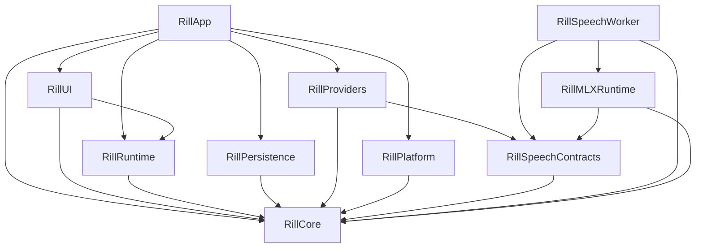

# Architecture

Rill separates domain contracts, runtime decisions, external effects, and UI
state. `Package.swift` defines the module graph; `AppBootstrap` assembles the
concrete implementations.

Speech recognition and text input are the product capabilities. Workflows are a
reusable composition layer for those capabilities; they do not own microphone,
input-method composition, or model resource lifetimes. Future input-method entry
points should reuse vocabulary, transformation and delivery contracts while
retaining their own input lifecycle.

Run cards join content-free receipts with optional text history and run-scoped
diagnostics. Recording length comes from captured audio; selected process steps
and output actions retain monotonic elapsed milliseconds. A step's TOML
`record_duration` controls measurement in both receipts and text history. Missing
measurements remain absent, including older receipts and unexecuted branches.

## Module dependencies

Arrows point from a consumer to its dependencies.

| Module | Responsibility |
| --- | --- |
| Core | Values, validation, privacy contracts, and ports such as `GlobalInputSource`, `SettingsStore`, and `RecordGraphPersistenceStore`. |
| Runtime | Session execution, authorization, Record graph commands, and resource lifetimes against Core ports. |
| Platform | macOS input, clipboard, focus, files, credentials, and other system adapters. |
| Providers | Recognition clients, text transformation, and external output implementations; no macOS adapter dependency. |
| SpeechContracts | Worker wire values, streaming contracts, and pinned local model manifests shared by host and worker. |
| Persistence | SQLite connection, schema migration, encryption, and transactional repositories. |
| UI | Observable presentation state, feature models, and SwiftUI/AppKit views. |
| App | Composition, application lifecycle, and window/controller integration. |
| MLXRuntime / SpeechWorker | Local ASR, TTS, and record-embedding execution in separate supervised helper processes. |

Runtime receives system effects through injected ports or closures. For example,
`RecordingSessionManager` owns the validity of a
`RecordingCueToken`, while App supplies the haptic effect. The adapter calls
`performIfValid` at the synchronous effect boundary, after reaching the main
actor, so cancelling a recording suppresses a cue still waiting to be played.

## State and lifetime ownership

| State | Owner | Boundary |
| --- | --- | --- |
| Records, memberships, routes, leases, and persistence revision | `RecordStore` | Commands commit before publishing catalog updates or collection events. |
| SQLite connection and transactions | `SQLitePersistenceStore` | Settings, history, and catalog extensions share one actor and connection. A transaction never suspends between statements. |
| Active recording and its cleanup | `RecordingSessionManager` | Cancellation invalidates cue tokens and retains pending work until it settles. |
| Authorized workflow run | `SessionCoordinator` | Frozen workflow/context and resolved provider plan remain attached to one run. |
| UI settings reads | `AppModelSettingsReadTaskOwner` | Replaced reads remain owned until drained; shutdown rejects new reads. |
| UI persistence tasks | `PersistenceWriteCoordinator` | Overlapping single-key and atomic multi-key writes serialize; all accepted tasks remain tracked until completion. |
| Unsaved settings and retry policy | `SettingsPersistenceModel` | Latest-write completion updates visible state; failures retain the exact value to retry. `AppSettingsCodec` owns stored-value decoding and migration. |
| Voice presentation | `VoiceRunModel` | Progress is accepted only from the currently presented run and lane. |
| History browsing | `RunHistoryModel` | Read sessions, page locators, deep links, and privacy-scoped queries have one owner. |
| Vocabulary | `VocabularyLibraryModel` | Collection mutations and legacy-rule projection update the runtime source together; persisted default bindings retain their scope and uses. |
| Terminal run body and receipt | `WorkflowRunReceiptRecorder` | Runtime freezes both values and commits them in one generation and one transaction; UI only reloads or displays an explicit session-only result. |
| Timed-out external work | `BoundedOperation` | A cancelled caller does not free the resource slot until the underlying operation returns. Shutdown seals and drains accepted work. |
| Workflow files and enabled state | `XDGWorkflowFileStore` and `WorkflowLibraryModel` | External editors own text editing. File writes check the last loaded source before replacement; file observation reloads validated definitions. |

`AppModel` receives its production services explicitly; `RillTestSupport` supplies
only test defaults. Feature models own their observable status and accepted task
collections. Settings changes enter explicit commands; assigning a field no longer
starts persistence or model work through `didSet`. Business presentation types live
beside their feature owner, while `L10n` is the single translation entry point.

`WorkflowRunReporter` publishes content-free, run/lane-scoped stage events even
when diagnostics are disabled. The output executor enters saving or delivering
at the actual action boundary. UI ignores stages from retired or mismatched runs.
Failed action receipts optionally carry proof that no output was applied. Missing
proof, cancelled actions, and legacy receipts remain unconfirmed; recovery never
automatically repeats an output and exposes existing text first.

Model adapters share `ModelFiles` for downloads, streaming digests and atomic
filesystem publication. Pinned inventories and receipt policies remain adapter
owned. A per-model process lock guards abandoned staging cleanup and publication;
a filesystem swap keeps an existing publication intact until replacement succeeds.

Settings writes and reads have different shutdown contracts. Reads can be
cancelled and sealed. Accepted writes must finish, including older writes whose
storage implementation ignores cancellation. `PersistenceWriteCoordinator`
therefore waits for a replaced write before starting the next value for that
key, ignores stale completion results, and drains tasks added during a flush.
Unrelated keys can progress independently. Store errors become feature presentation
state; the task owner does not know about localization, credentials,
or workflow availability.

SQLite repository extensions divide queries by domain while preserving the
connection's transaction boundary. Splitting them into independent actors would
require a new transaction contract, particularly for history clear barriers and
Record migration. File size alone is not a reason to introduce that separation.

`AuthorizedLiveAudioSession` shares the capture admission boundary between held
recording and workflow-controlled recording: it validates the run and audio
lifetime, monitors revocation, rechecks immediately before capture, and starts
context preparation only after capture begins. Gesture and window state remain
with their respective controllers.

`EventBus` bounds each subscriber buffer and diagnostic tail. Consecutive
presentation updates coalesce; lifecycle boundaries apply backpressure. Terminal
run, history, and final presentation updates retain admission even when their
producer is cancelled. Shutdown drains producers while consumers are alive,
then observes the delivery barrier before closing the UI consumer.

The speech model pool owns model loading. UI selection and explicit preparation
use the injected trusted catalog; legacy custom model keys are migration inputs,
not a second active configuration or automatic preparation path.

## Recognition and presentation boundaries

The authorization entry freezes the model ID, language, vocabulary revision and
resolved hints. Capture preview and final recognition use that same snapshot.
Execution still checks live authorization and model enablement; changing the
selected model during capture never silently redirects the admitted request.
`RecognitionRequest` contains run identity, priority, context needed for selection
capture, audio and recognition options. Providers no longer receive a workflow
or re-resolve its route. Vocabulary collections remain within Runtime; the
provider receives only the resolved hints.

Offline and streaming hint capabilities are distinct. Current Qwen streaming
reports requested keyterms as unsupported. Final recognition keeps established
candidate limits and applies a complete-prompt token budget using the loaded
model tokenizer. Omitted terms are counted, never truncated. Tail PCM accepted
before capture stops reaches both WAV storage and an active preview session;
diagnostics count delivered preview samples and drained tail samples. Preview
observations are host timestamps, not proof of screen presentation.

`WorkflowAudioRunController` belongs to Runtime. Its preparing, starting,
recording and stopping states keep the corresponding run resources together;
finishing work retains its existing independent cleanup ownership. `AppModel`
callers access existing feature owners directly rather than through duplicate
state forwarding. Remaining settings commands and lifecycle coordination still
live in AppModel; this is not yet a claim that all its responsibilities migrated.

`OutputAction.execute(record:context:)` is the sole required output entry.
Text convenience calls convert once to a Record draft. Output action results,
including uncertain delivery, keep the existing receipt contract and must never
cause an automatic repeat send.

Atomic settings migration, its legacy recovery copy, ordinary edits and retries
share `PersistenceWriteCoordinator`. An overlapping edit waits for the whole
older transaction; it cannot cancel the transaction's unrelated keys. Failures
remain visible and retain current per-key retry values. Shutdown drains accepted
migration writes as well as user edits.

`RecordStore` has one graph value type for live state and the committed rollback
value. Publication still follows a successful commit. SQLite schema/migration
and diagnostic operations are extensions of the same actor and connection.
`RecordQuerySession` binds pagination to one catalog revision; workspace and
quick-panel consumers retain their own result limits, and reject mixed pages.

## Workflow representation

Workflow TOML under the XDG configuration directory is the durable source of
truth. `WorkflowDocument` is the parsed value; external text editors own editing.
The application manages activation and templates through `WorkflowFileStore`.
The codec owns TOML
syntax, Core owns plan validation, and `WorkflowPlanCompiler` resolves runtime
providers and vocabulary. Validated process steps become an immutable enum-based
execution plan, so the interpreter does not repeatedly interpret optional DTO fields.
Output configuration is validated and frozen by action position, including repeated
action kinds with different destinations. `WorkflowTextExecutor` executes the
compiled text steps; `WorkflowOutputExecutor` owns ordered output actions and their
receipt settlement. `SessionCoordinator` owns admission and stage transitions, and
`WorkflowRunDiagnostics` records execution progress. Manifest checks use the same
semantic compiler as execution.

Legacy workflow migration is resumable by workflow ID. Existing TOML files are
preserved, missing files are created with an explicit missing-file expectation,
and the legacy library remains active until every definition is accounted for.
The protected legacy settings retain a recovery copy after successful migration.
Partially created files retain their source expectations on reload; deleting or
replacing a workflow checks for external edits and saves the accepted old source
as a private recovery version.

`WorkflowPlan.acceptingTextInput()` is the shared projection for Record replay,
explicit clipboard-text runs, and audio-to-text projection. It removes the root
recognition/resolution stages and speech route while preserving step identities,
branches, vocabulary, and output policy. It leaves malformed nested speech
steps available for validation to reject. Projection produces a new value;
existing workflow and run snapshots remain unchanged.

Explicit text runs retain outputs and use the normal authorized execution path.
The compiler can validate a text projection while retaining the original
declaration for run receipts.

See [Record architecture](record-architecture.md) for graph invariants and
[workflow TOML](workflow-toml.md) for the file format.

## Verification

Run `just ci` for the repository hooks, release build and packaging checks, and
complete test suite. `scripts/test.sh` runs domain tests with four workers and
native platform, UI, and application tests serially. CI executes the same suite
through `preflight.sh`. Build modes and cache boundaries are defined in the
[contribution guide](https://github.com/zrr1999/rill/blob/main/CONTRIBUTING.md).
`check_module_boundaries.py` checks SwiftPM dependencies and compiler-reported
imports for every production and test target, including direct dependency
declarations. `scripts/swift_locked.sh test-domain` selects a reduced graph from
the same manifest into a separate cache; it cannot replace the full CI gate. Optional `just test-render` and `just test-stress` capture rendering and
large-catalog evidence separately from normal gates.

Boundary regressions use controllable stores and suspended
operations to verify ordering, cancellation, and shutdown behavior. Physical
Fn input, haptics, microphone use, paste, and accessibility still require the
device checks in the [release QA checklist](release-qa-checklist.md).
