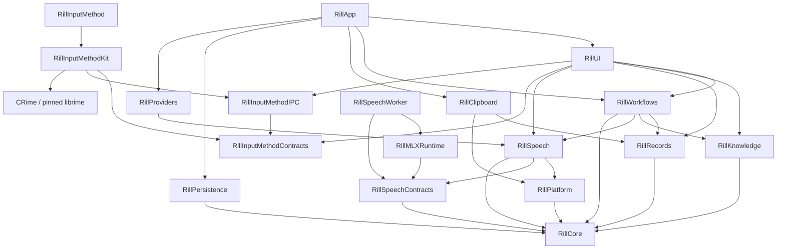

# Architecture

Rill separates domain contracts, runtime decisions, external effects, and UI
state. `Package.swift` defines the module graph; `AppBootstrap` assembles the
concrete implementations.

## Module dependencies

Arrows point from a consumer to its dependencies.

| Module | Responsibility |
| --- | --- |
| Core | Shared values, privacy contracts, and ports. No feature implementation dependencies. |
| Speech | Audio capture, ASR/TTS, voice input hub and worker client. Speech requests carry a frozen configuration and resolved hints, not a workflow definition. Model catalogs and worker protocols stay in SpeechContracts. |
| Clipboard | Passive system clipboard observation, collection controls and capture adapter. Ordinary copy/paste remains native. |
| Records | Record graph, collection/search/retention operations, ingestion and delivery interaction. `RecordStore` remains the sole graph owner. |
| Knowledge | Vocabulary suggestions and context memory preparation/maintenance. Their authorization and scopes stay separate. |
| Workflows | Trigger/session orchestration, selected-text input, workflow execution, cancellation and receipts. It connects Record reuse to workflow execution. |
| InputMethod / InputMethodKit | Independent InputMethodKit process, Rime sessions and nonactivating AppKit candidates. No application, speech, workflow or database dependency. |
| InputMethodContracts | Versioned messages and installation paths shared by the two processes. |
| InputMethodIPC | Nonblocking local stream transport, framing and mutual process identity checks using the macOS Security adapter. |
| Platform / Providers / Persistence | macOS adapters, text/output providers, and the single SQLite connection/transaction owner. |
| UI / App | Observable feature models and views; composition, lifecycle and navigation. |
| SpeechContracts / MLXRuntime / SpeechWorker | Lightweight worker contracts and local model execution in a separate process; the worker does not import Speech or host providers. |

`SpeechFeatureModel`, `SystemClipboardFeatureModel`, `WorkflowLibraryModel`,
`KnowledgeFeatureModel` and `InputMethodFeatureModel` own their observable state.
Speech owns the existing `VoiceRunModel`; Knowledge owns `VocabularyLibraryModel`
and context-memory presentation. The existing settings persistence model remains
the single owner of settings read/write lifecycle.
The existing Record feature models retain their ownership. Vocabulary commands
remain on the existing `VocabularyLibraryModel`. AppModel keeps compatibility properties and
cross-feature settings/workflow composition while existing views migrate; those
properties forward to the same feature state and do not store a second copy.

System effects enter through ports or closures. For example,
`RecordingSessionManager` and `WorkflowAudioRunController` own the validity of
their `RecordingCueToken` values, while App supplies the shared sound and haptic
effect. Validation and playback scheduling share one synchronous boundary after
the MainActor hop. Clipboard capture receives only a Record ingestion
port. `RecordInteractionController` owns delivery serialization and its shutdown
drain separately from the clipboard polling lifecycle.

## State and lifetime ownership

| State | Owner | Boundary |
| --- | --- | --- |
| Records, memberships, routes, leases, and persistence revision | `RecordStore` | Commands commit before publishing catalog updates or collection events. |
| SQLite connection and transactions | `SQLitePersistenceStore` | Settings, history, and catalog extensions share one actor and connection. A transaction never suspends between statements. |
| Active workflow recording and its cleanup | `RecordingSessionManager` | Cancellation invalidates cue tokens and retains pending work until it settles. |
| Authorized workflow run | `SessionCoordinator` | Frozen workflow/context and resolved provider plan remain attached to one run. |
| Live recognition context | `LiveRecognitionContextResolver` | Compiles vocabulary once at capture admission; the processing lease carries the frozen plan, language, model and hints to final recognition. |
| Optional hotword ranking | `HotwordSelection` in Workflows | Owns independent session consent, the bounded memory cache and background tasks. It validates the shared Jev credential before and after requests; App shutdown drains accepted work. |
| UI settings reads | `AppModelSettingsReadTaskOwner` | Replaced reads remain owned until drained; shutdown rejects new reads. |
| UI persistence tasks | `PersistenceWriteCoordinator` | Replacement writes serialize per setting key; all accepted tasks remain tracked until completion. |
| Unsaved settings presentation and retry policy | `AppModel` | Latest-write completion updates visible state; failures retain the exact value to retry. |
| Workflow files and enabled state | `XDGWorkflowFileStore` and `AppModel` | External editors own text editing. File writes check the last loaded source before replacement; file observation reloads validated definitions. |

Settings writes and reads have different shutdown contracts. Reads can be
cancelled and sealed. Accepted writes must finish, including older writes whose
storage implementation ignores cancellation. `PersistenceWriteCoordinator`
therefore waits for a replaced write before starting the next value for that
key, ignores stale completion results, and drains tasks added during a flush.
Unrelated keys can progress independently. Store errors become presentation
state in AppModel; the task owner does not know about localization, credentials,
or workflow availability.

SQLite repository extensions divide queries by domain while preserving the
connection's transaction boundary. Splitting them into independent actors would
require a new transaction contract, particularly for history clear barriers and
Record migration. File size alone is not a reason to introduce that separation.

## Workflow representation

Workflow TOML under the XDG configuration directory is the durable source of
truth. `WorkflowDocument` is the parsed value; external text editors own editing.
The application manages activation and templates through `WorkflowFileStore`.
The codec owns TOML
syntax, Core owns plan validation, and `WorkflowPlanCompiler` resolves runtime
providers and vocabulary.

`WorkflowPlan.acceptingTextInput()` is the shared projection for Record replay,
explicit clipboard-text runs, and audio-to-text projection. It removes the root
recognition/resolution stages and speech route while preserving step identities,
branches, vocabulary, and output policy. It leaves malformed nested speech
steps available for validation to reject. Projection produces a new value;
existing workflow and run snapshots remain unchanged.

Explicit text runs retain outputs and use the normal authorized execution path.
The compiler can validate a text projection while retaining the original
declaration for run receipts.

See [Record architecture](record-architecture.md) for graph invariants and
[workflow TOML](workflow-toml.md) for the file format.

## Verification

Run `just ci` for the repository hooks, release build and packaging checks, and
complete test suite. Boundary regressions use controllable stores and suspended
operations to verify ordering, cancellation, and shutdown behavior. Physical
IME/Fn input, haptics, microphone use, paste, and accessibility still require the
device checks in the [release QA checklist](release-qa-checklist.md).

## Current implementation choices

Local recognition uses native `mlx-audio-swift` through a supervised worker, with
Qwen3-ASR 0.6B as the default and 1.7B as an optional larger model. Streaming text
is a preview; the final decode of the captured recording owns the delivered text.
Pinned artifacts and licenses belong in `LOCAL_MODEL_NOTICES.md` and the model
catalogs, not a second selection table. Historical engine comparisons are in
[archived research](archive/research/technology-selection.md).

SQLite persistence owns encrypted records, history and memory. LLM transport uses
the configured Responses-compatible provider; workflow execution does not depend
on its SDK types. Vocabulary bindings distinguish recognition hints from explicit
post-recognition replacement; `VocabularyLibraryModel` updates the runtime source
and persisted defaults together. Prospective guard rules and prompt-variable
designs in the archive are not supported product contracts.

`JevSessionSettingsSource` is the sole session credential owner. The composition
root injects it into candidate ranking and the polishing gate. UI consent is
separate from possession of a valid-format key. Replacement/clearing revokes old
authorization identities synchronously; responses are revalidated before use.
No key or comparison-return intent is persisted. A return intent contains query,
filters, selection and IDs only; returning reloads current summaries and prepares
a fresh review without sending it.

`RecordSearch` coordinates literal-first scans and approximate fallback for global
search and the quick panel. Its cursor binds query, matching mode, catalog revision
and offset. It owns no content index; `RecordStore` remains authoritative. Each
presentation owner cancels stale work and guards publication separately.

Durable workflow receipts retain executed positions, step kinds, result codes,
ordered output receipts and opted-in measured durations. They omit prompts,
names, paths and sample bodies. Older receipt versions remain readable; history
uses each receipt's own step kinds rather than today's edited workflow.
