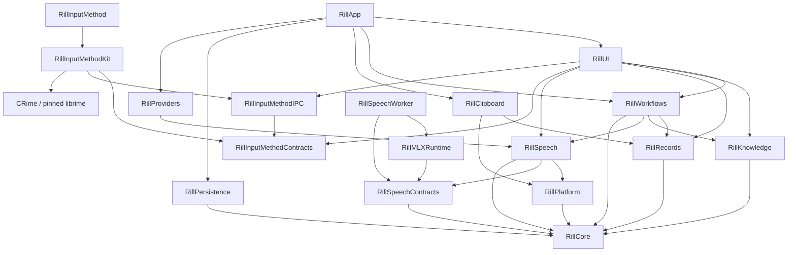

# Architecture

Rill separates domain contracts, runtime decisions, external effects, and UI
state. `Package.swift` defines the module graph; `AppBootstrap` assembles the
concrete implementations.

## Module dependencies

Arrows point from a consumer to its dependencies.

| Module | Responsibility |
| --- | --- |
| Core | Shared values, privacy contracts, and ports. No feature implementation dependencies. |
| Speech | ASR/TTS and worker client. Microphone capture and voice input hub live in Platform. Speech requests carry a frozen configuration and resolved hints, not a workflow definition. Model catalogs and worker protocols stay in SpeechContracts. |
| Clipboard | Passive system clipboard observation, collection controls and capture adapter. Ordinary copy/paste remains native. |
| Records | Record graph, collection/search/retention operations, ingestion and delivery interaction. `RecordStore` remains the sole graph owner. |
| Knowledge | Vocabulary suggestions and context memory preparation/maintenance. Their authorization and scopes stay separate. |
| Workflows | Trigger/session orchestration, selected-text input, workflow execution, cancellation and receipts. It connects Record reuse to workflow execution. |
| InputMethod / InputMethodKit | Independent InputMethodKit process, Rime sessions and nonactivating AppKit candidates. No application, speech, workflow or database dependency. |
| InputMethodContracts | Versioned messages and installation paths shared by the two processes. |
| InputMethodIPC | Nonblocking local stream transport, framing and mutual process identity checks using the macOS Security adapter. |
| Platform / Providers / Persistence | macOS adapters, text/output providers, and the single SQLite connection/transaction owner. |
| UI / App | Observable feature models and views; composition, lifecycle and navigation. |
| SpeechContracts / MLXRuntime / SpeechWorker | Lightweight worker contracts and local model execution in a separate process; the worker does not import Speech or host providers. |

`VoiceRunModel`, `WorkflowLibraryModel`, `VocabularyLibraryModel`,
`RunHistoryModel`, `SettingsPersistenceModel` and `InputMethodFeatureModel` own
observable feature state. Views read those owners directly; compatibility state
facades have been removed. `AppModel` still connects application events, settings
commands and lifecycle effects across features. The composition root supplies
production dependencies explicitly; test factories belong to test-only targets.

System effects enter through ports or closures. For example,
`RecordingSessionManager` and `WorkflowAudioRunController` own the validity of
their `RecordingCueToken` values, while App supplies the shared sound and haptic
effect. Validation and playback scheduling share one synchronous boundary after
the MainActor hop. Clipboard capture receives only a Record ingestion
port. `RecordInteractionController` owns delivery serialization and its shutdown
drain separately from the clipboard polling lifecycle.

## State and lifetime ownership

| State | Owner | Boundary |
| --- | --- | --- |
| Records, memberships, routes, leases, and persistence revision | `RecordStore` | Commands commit before publishing catalog updates or collection events. |
| SQLite connection and transactions | `SQLitePersistenceStore` | Settings, history, and catalog extensions share one actor and connection. A transaction never suspends between statements. |
| Active workflow recording and its cleanup | `RecordingSessionManager` | Cancellation invalidates cue tokens and retains pending work until it settles. |
| Authorized workflow run | `SessionCoordinator` | Frozen workflow/context and resolved provider plan remain attached to one run. |
| Live recognition context | `LiveRecognitionContextResolver` | Compiles vocabulary once at capture admission; the processing lease carries the frozen plan, language, model and hints to final recognition. |
| Optional hotword ranking | `HotwordSelection` in Workflows | Owns independent session consent, the bounded memory cache and background tasks. It validates the shared Jev credential before and after requests; App shutdown drains accepted work. |
| UI settings reads | `AppModelSettingsReadTaskOwner` | Replaced reads remain owned until drained; shutdown rejects new reads. |
| UI persistence tasks | `PersistenceWriteCoordinator` | Overlapping single-key and atomic multi-key writes serialize; all accepted tasks remain tracked until completion. |
| Unsaved settings and retry policy | `SettingsPersistenceModel` | Latest-write completion updates visible state; failures retain the exact value to retry. `AppSettingsCodec` owns stored-value decoding and migration. |
| Voice presentation | `VoiceRunModel` | Progress is accepted only from the currently presented run and lane. |
| History browsing | `RunHistoryModel` | Read sessions, page locators, deep links, and privacy-scoped queries have one owner. |
| Vocabulary | `VocabularyLibraryModel` | Collection mutations and legacy-rule projection update the runtime source together; persisted default bindings retain their scope and uses. |
| Terminal run body and receipt | `WorkflowRunReceiptRecorder` | Runtime freezes both values and commits them in one generation and one transaction; UI only reloads or displays an explicit session-only result. |
| Timed-out external work | `BoundedOperation` | A cancelled caller does not free the resource slot until the underlying operation returns. Shutdown seals and drains accepted work. |
| Workflow files and enabled state | `XDGWorkflowFileStore` and `WorkflowLibraryModel` | External editors own text editing. File writes check the last loaded source before replacement; file observation reloads validated definitions. |

`AppModel` receives its production services explicitly; `RillTestSupport` supplies
only test defaults. Feature models own their observable status and accepted task
collections. Settings changes enter explicit commands; assigning a field no longer
starts persistence or model work through `didSet`. Business presentation types live
beside their feature owner, while `L10n` is the single translation entry point.

`WorkflowRunReporter` publishes content-free, run/lane-scoped stage events even
when diagnostics are disabled. The output executor enters saving or delivering
at the actual action boundary. UI ignores stages from retired or mismatched runs.
Failed action receipts optionally carry proof that no output was applied. Missing
proof, cancelled actions, and legacy receipts remain unconfirmed; recovery never
automatically repeats an output and exposes existing text first.

Model adapters share `ModelFiles` for downloads, streaming digests and atomic
filesystem publication. Pinned inventories and receipt policies remain adapter
owned. A per-model process lock guards abandoned staging cleanup and publication;
a filesystem swap keeps an existing publication intact until replacement succeeds.

Settings writes and reads have different shutdown contracts. Reads can be
cancelled and sealed. Accepted writes must finish, including older writes whose
storage implementation ignores cancellation. `PersistenceWriteCoordinator`
therefore waits for a replaced write before starting the next value for that
key, ignores stale completion results, and drains tasks added during a flush.
Unrelated keys can progress independently. Store errors become presentation
state in AppModel; the task owner does not know about localization, credentials,
or workflow availability.

SQLite repository extensions divide queries by domain while preserving the
connection's transaction boundary. Splitting them into independent actors would
require a new transaction contract, particularly for history clear barriers and
Record migration. File size alone is not a reason to introduce that separation.

`AuthorizedLiveAudioSession` shares the capture admission boundary between held
recording and workflow-controlled recording: it validates the run and audio
lifetime, monitors revocation, rechecks immediately before capture, and starts
context preparation only after capture begins. Gesture and window state remain
with their respective controllers.

`EventBus` bounds each subscriber buffer and diagnostic tail. Consecutive
presentation updates coalesce; lifecycle boundaries apply backpressure. Terminal
run, history, and final presentation updates retain admission even when their
producer is cancelled. Shutdown drains producers while consumers are alive,
then observes the delivery barrier before closing the UI consumer.

The speech model pool owns model loading. UI selection and explicit preparation
use the injected trusted catalog; legacy custom model keys are migration inputs,
not a second active configuration or automatic preparation path.

## Recognition and presentation boundaries

The authorization entry freezes the model ID, language, vocabulary revision and
resolved hints. Capture preview and final recognition use that same snapshot.
Execution still checks live authorization and model enablement; changing the
selected model during capture never silently redirects the admitted request.
`RecognitionRequest` contains run identity, priority, context needed for selection
capture, audio and recognition options. Providers no longer receive a workflow
or re-resolve its route. Vocabulary collections remain within RillWorkflows; the
provider receives only the resolved hints.

Offline and streaming hint capabilities are distinct. Current Qwen streaming
reports requested keyterms as unsupported. Final recognition keeps established
candidate limits and applies a complete-prompt token budget using the loaded
model tokenizer. Omitted terms are counted, never truncated. Tail PCM accepted
before capture stops reaches both WAV storage and an active preview session;
diagnostics count delivered preview samples and drained tail samples. Preview
observations are host timestamps, not proof of screen presentation.

`WorkflowAudioRunController` belongs to RillWorkflows. Its preparing, starting,
recording and stopping states keep the corresponding run resources together;
finishing work retains its existing independent cleanup ownership. `AppModel`
callers access existing feature owners directly rather than through duplicate
state forwarding. Remaining settings commands and lifecycle coordination still
live in AppModel; this is not yet a claim that all its responsibilities migrated.

`OutputAction.execute(record:context:)` is the sole required output entry.
Text convenience calls convert once to a Record draft. Output action results,
including uncertain delivery, keep the existing receipt contract and must never
cause an automatic repeat send.

Atomic settings migration, its legacy recovery copy, ordinary edits and retries
share `PersistenceWriteCoordinator`. An overlapping edit waits for the whole
older transaction; it cannot cancel the transaction's unrelated keys. Failures
remain visible and retain current per-key retry values. Shutdown drains accepted
migration writes as well as user edits.

`RecordStore` has one graph value type for live state and the committed rollback
value. Publication still follows a successful commit. SQLite schema/migration
and diagnostic operations are extensions of the same actor and connection.
`RecordSearchCursor` binds pagination and query identity to one catalog revision; workspace and
quick-panel consumers retain their own result limits, and reject mixed pages.

## Workflow representation

Workflow TOML under the XDG configuration directory is the durable source of
truth. `WorkflowDocument` is the parsed value; external text editors own editing.
The application manages activation and templates through `WorkflowFileStore`.
The codec owns TOML
syntax, Core owns plan validation, and `WorkflowPlanCompiler` resolves runtime
providers and vocabulary. Validated process steps become an immutable enum-based
execution plan, so the interpreter does not repeatedly interpret optional DTO fields.
Output configuration is validated and frozen by action position, including repeated
action kinds with different destinations. `WorkflowTextExecutor` executes the
compiled text steps; `WorkflowOutputExecutor` owns ordered output actions and their
receipt settlement. `SessionCoordinator` owns admission and stage transitions, and
`WorkflowRunDiagnostics` records execution progress. Manifest checks use the same
semantic compiler as execution.

Legacy workflow migration is resumable by workflow ID. Existing TOML files are
preserved, missing files are created with an explicit missing-file expectation,
and the legacy library remains active until every definition is accounted for.
The protected legacy settings retain a recovery copy after successful migration.
Partially created files retain their source expectations on reload; deleting or
replacing a workflow checks for external edits and saves the accepted old source
as a private recovery version.

`WorkflowPlan.acceptingTextInput()` is the shared projection for Record replay,
explicit clipboard-text runs, and audio-to-text projection. It removes the root
recognition/resolution stages and speech route while preserving step identities,
branches, vocabulary, and output policy. It leaves malformed nested speech
steps available for validation to reject. Projection produces a new value;
existing workflow and run snapshots remain unchanged.

Explicit text runs retain outputs and use the normal authorized execution path.
The compiler can validate a text projection while retaining the original
declaration for run receipts.

See [Record architecture](record-architecture.md) for graph invariants and
[workflow TOML](workflow-toml.md) for the file format.

## Verification

Run `just ci` for the repository hooks, release build and packaging checks, and
complete test suite. `scripts/test.sh` runs domain tests with four workers and
native platform, UI, and application tests serially. CI executes the same suite
through `preflight.sh`. Build modes and cache boundaries are defined in the
[contribution guide](https://github.com/zrr1999/rill/blob/main/CONTRIBUTING.md).
`check_module_boundaries.py` checks SwiftPM dependencies and compiler-reported
imports for every production and test target, including direct dependency
declarations. `scripts/swift_locked.sh test-domain` selects a reduced graph from
the same manifest into a separate cache; it cannot replace the full CI gate. Optional `just test-render` and `just test-stress` capture rendering and
large-catalog evidence separately from normal gates.

Boundary regressions use controllable stores and suspended
operations to verify ordering, cancellation, and shutdown behavior. Physical
IME/Fn input, haptics, microphone use, paste, and accessibility still require the
device checks in the [release QA checklist](release-qa-checklist.md).

System capture, microphone arbitration, PCM file writing, Shortcuts and Markdown
file output live in `RillPlatform`. Providers own model/network adapters and pass
streaming sessions through the Core preview contract. VAD observations carry
speech state and duration; platform code never imports worker frames or MLX
chunk constants. The composition root injects the preview session factory.

History, receipt and diagnostic repositories require generation-aware writes.
Their maintenance ports are separate, explicit contracts. Local retention only
requires those maintenance ports; `DiagnosticsRecorder` requires both when a
persistent repository is supplied, so deletion cannot silently bypass storage.
Timestamp-only deletion remains at backend compatibility boundaries.

Temporary audio file removal, timeout isolation and retry cleanup are owned by
`RillPlatform`. Runtime receives `ManagedTemporaryAudioCleaning` and an explicit
isolation/removal operation; it never copies or deletes audio through Core value
types. A timed-out recognizer keeps its isolated file until the actual operation
returns, then transfers it to the shared cleanup owner. File ownership and path
validation remain mandatory. Legacy JSON manifest decoding stays in Core; only
the migration adapter reads the file. Runtime test defaults live in
`RillDomainTestSupport`, which is excluded from production dependencies.

### 评测、诊断和功能命令

`DiagnosticEventName` 是诊断生产端的固定事件类型；字符串只在 JSON/SQLite 边界出现，
未知持久化事件转换为 invalid sentinel，保留旧格式兼容。敏感内容仍由既有清洗器限制。
`BenchmarkRecordingArchiveModel` 单独拥有设置写入、元数据选择、授权和导出任务；
Platform 的 `BenchmarkCorpusExporter` 负责认证读取、私有暂存和原子发布。
历史维护周期任务归 `RunHistoryModel`，时钟显式注入；测试控制 tick 和完成条件。
设置可用性、LLM 验证及其代际取消归 `SettingsPersistenceModel`，工作流解释的任务、
失效和回执校验归 `WorkflowLibraryModel`；视图直接发出功能命令，不再经过 AppModel 转发。

语音资源准备与查询命令进一步收敛：`VoiceRunModel` 拥有唤醒词和本地 ASR
准备任务、取消与进度发布；模型切换和退出使旧任务失去发布资格。生产组合根完整
注入唤醒词、TTS 选择、验证与播放服务，删除没有产品调用方的独立 TTS 下载入口。
本地 ASR 准备只保留一个任务身份，取消后的工作仍由既有任务所有者保留；终止退出
遵守原有非阻塞策略，不把取消或句柄释放当成底层推理已退出。

词库模型直接接受编辑命令，更新运行时词库并通过统一设置协调器写入。旧规则只在
加载/恢复时迁移，展示投影由当前集合计算；不再保存平行规则数组或 revision 转发层。
词库加载中、不可用或退出后拒绝所有编辑命令。删除词库涉及工作流绑定，仍由应用入口协调。

工作区、全局搜索与快捷面板使用同一 `RecordSearch` 游标规则。工作区保留每页 100 条、
快捷面板保留每页 50 条的策略；工作区只在整轮查询完成后发布匹配集合。查询、筛选和
预览选择通过显式命令驱动，批量重置只启动一次查询，不使用 `didSet` 副作用链。
