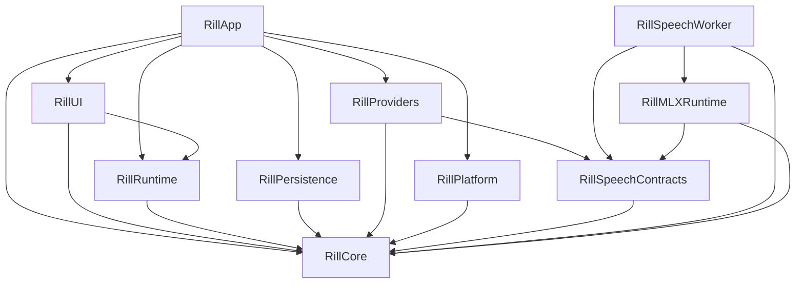

# Architecture

Rill separates domain contracts, runtime decisions, external effects, and UI
state. `Package.swift` defines the module graph; `AppBootstrap` assembles the
concrete implementations.

## Module dependencies

Arrows point from a consumer to its dependencies.

| Module | Responsibility |
| --- | --- |
| Core | Values, validation, privacy contracts, and ports such as `GlobalInputSource`, `SettingsStore`, and `RecordGraphPersistenceStore`. |
| Runtime | Session execution, authorization, Record graph commands, and resource lifetimes against Core ports. |
| Platform | macOS input, clipboard, focus, files, credentials, and other system adapters. |
| Providers | Recognition clients, text transformation, and external output implementations; no macOS adapter dependency. |
| SpeechContracts | Worker wire values, streaming contracts, and pinned local model manifests shared by host and worker. |
| Persistence | SQLite connection, schema migration, encryption, and transactional repositories. |
| UI | Observable presentation state, feature models, and SwiftUI/AppKit views. |
| App | Composition, application lifecycle, and window/controller integration. |
| MLXRuntime / SpeechWorker | Local model execution in the separate speech process. |

Runtime receives system effects through injected ports or closures. For example,
`RecordingSessionManager` owns the validity of a
`RecordingCueToken`, while App supplies the haptic effect. The adapter calls
`performIfValid` at the synchronous effect boundary, after reaching the main
actor, so cancelling a recording suppresses a cue still waiting to be played.

## State and lifetime ownership

| State | Owner | Boundary |
| --- | --- | --- |
| Records, memberships, routes, leases, and persistence revision | `RecordStore` | Commands commit before publishing catalog updates or collection events. |
| SQLite connection and transactions | `SQLitePersistenceStore` | Settings, history, and catalog extensions share one actor and connection. A transaction never suspends between statements. |
| Active recording and its cleanup | `RecordingSessionManager` | Cancellation invalidates cue tokens and retains pending work until it settles. |
| Authorized workflow run | `SessionCoordinator` | Frozen workflow/context and resolved provider plan remain attached to one run. |
| UI settings reads | `AppModelSettingsReadTaskOwner` | Replaced reads remain owned until drained; shutdown rejects new reads. |
| UI persistence tasks | `PersistenceWriteCoordinator` | Replacement writes serialize per setting key; all accepted tasks remain tracked until completion. |
| Unsaved settings and retry policy | `SettingsPersistenceModel` | Latest-write completion updates visible state; failures retain the exact value to retry. `AppSettingsCodec` owns stored-value decoding and migration. |
| Voice presentation | `VoiceRunModel` | Progress is accepted only from the currently presented run and lane. |
| History browsing | `RunHistoryModel` | Read sessions, page locators, deep links, and privacy-scoped queries have one owner. |
| Vocabulary | `VocabularyLibraryModel` | Collection mutations and legacy-rule projection update the runtime source together; persisted default bindings retain their scope and uses. |
| Terminal run body and receipt | `WorkflowRunReceiptRecorder` | Runtime freezes both values and commits them in one generation and one transaction; UI only reloads or displays an explicit session-only result. |
| Timed-out external work | `BoundedOperation` | A cancelled caller does not free the resource slot until the underlying operation returns. Shutdown seals and drains accepted work. |
| Workflow files and enabled state | `XDGWorkflowFileStore` and `WorkflowLibraryModel` | External editors own text editing. File writes check the last loaded source before replacement; file observation reloads validated definitions. |

Settings writes and reads have different shutdown contracts. Reads can be
cancelled and sealed. Accepted writes must finish, including older writes whose
storage implementation ignores cancellation. `PersistenceWriteCoordinator`
therefore waits for a replaced write before starting the next value for that
key, ignores stale completion results, and drains tasks added during a flush.
Unrelated keys can progress independently. Store errors become feature presentation
state; the task owner does not know about localization, credentials,
or workflow availability.

SQLite repository extensions divide queries by domain while preserving the
connection's transaction boundary. Splitting them into independent actors would
require a new transaction contract, particularly for history clear barriers and
Record migration. File size alone is not a reason to introduce that separation.

`AuthorizedLiveAudioSession` shares the capture admission boundary between held
recording and workflow-controlled recording: it validates the run and audio
lifetime, monitors revocation, rechecks immediately before capture, and starts
context preparation only after capture begins. Gesture and window state remain
with their respective controllers.

`EventBus` bounds each subscriber buffer and diagnostic tail. Consecutive
presentation updates coalesce; lifecycle boundaries apply backpressure. Terminal
run, history, and final presentation updates retain admission even when their
producer is cancelled. Shutdown drains producers while consumers are alive,
then observes the delivery barrier before closing the UI consumer.

The speech model pool owns model loading. UI selection and explicit preparation
use the injected trusted catalog; legacy custom model keys are migration inputs,
not a second active configuration or automatic preparation path.

## Workflow representation

Workflow TOML under the XDG configuration directory is the durable source of
truth. `WorkflowDocument` is the parsed value; external text editors own editing.
The application manages activation and templates through `WorkflowFileStore`.
The codec owns TOML
syntax, Core owns plan validation, and `WorkflowPlanCompiler` resolves runtime
providers and vocabulary. Validated process steps become an immutable enum-based
execution plan, so the interpreter does not repeatedly interpret optional DTO fields.
Output configuration is validated and frozen by action position, including repeated
action kinds with different destinations. `WorkflowTextExecutor` executes the
compiled steps; `SessionCoordinator` owns admission and output delivery, and
`WorkflowRunDiagnostics` records execution progress. Manifest checks use the same
semantic compiler as execution.

Legacy workflow migration is resumable by workflow ID. Existing TOML files are
preserved, missing files are created with an explicit missing-file expectation,
and the legacy library remains active until every definition is accounted for.
The protected legacy settings retain a recovery copy after successful migration.
Partially created files retain their source expectations on reload; deleting or
replacing a workflow checks for external edits and saves the accepted old source
as a private recovery version.

`WorkflowPlan.acceptingTextInput()` is the shared projection for Record replay,
explicit clipboard-text runs, and audio-to-text projection. It removes the root
recognition/resolution stages and speech route while preserving step identities,
branches, vocabulary, and output policy. It leaves malformed nested speech
steps available for validation to reject. Projection produces a new value;
existing workflow and run snapshots remain unchanged.

Explicit text runs retain outputs and use the normal authorized execution path.
The compiler can validate a text projection while retaining the original
declaration for run receipts.

See [Record architecture](record-architecture.md) for graph invariants and
[workflow TOML](workflow-toml.md) for the file format.

## Verification

Run `just ci` for the repository hooks, release build and packaging checks, and
complete test suite. `scripts/test.sh` runs domain tests with four workers and
native platform, UI, and application tests serially. CI executes the same suite
through `preflight.sh`. Build modes and cache boundaries are defined in the
[contribution guide](https://github.com/zrr1999/rill/blob/main/CONTRIBUTING.md).
`check_module_boundaries.py` checks SwiftPM dependencies and compiler-reported
imports. Optional `just test-render` and `just test-stress` capture rendering and
large-catalog evidence separately from normal gates.

Boundary regressions use controllable stores and suspended
operations to verify ordering, cancellation, and shutdown behavior. Physical
Fn input, haptics, microphone use, paste, and accessibility still require the
device checks in the [release QA checklist](release-qa-checklist.md).
