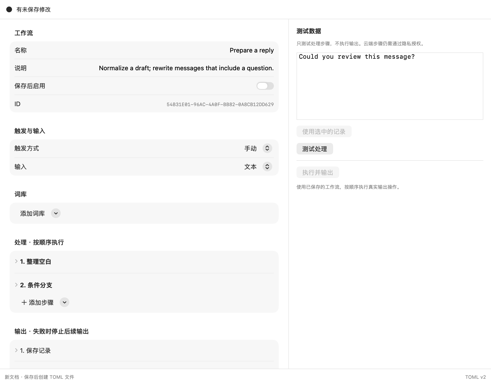
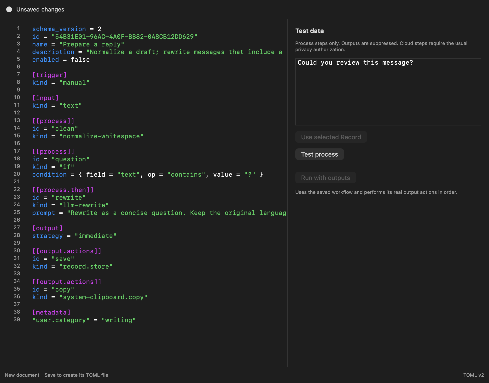

# Workflow editor v2 verification

> 历史材料，保留原始研究、计划或验收范围；不代表当前功能或发布结论。
> 归档基线：main `9e786a6`。当前使用说明见 [用户指南](../../../usage.md)。

Validation date: 2026-09-15. Working-source base:
`2eda5e163307aab0e4c92c7c9f9a7b7f3503f2f4` on `main`, with existing and workflow
changes present. No commit, push, installed-app replacement or second Rill process
was performed for this verification.

- `just ci`: passed, including repository hooks, arm64 Release products,
  resource/bundle assembly checks and the full test suite. The full suite had
  1,748 passing Swift tests and four opt-in/environment skips.
- Final workflow regression selection: passed. Seventeen new Swift Testing cases
  cover complete document round-trips, malformed/unknown structures, conditions,
  effect isolation, partial outputs, source/form synchronization, file conflicts,
  private writes, history, recovery and file watching. Existing XDG/v1 tests also
  pass; an edited v1 source is retained in history on its first v2 save.
- `RILL_UI_SNAPSHOT_DIR=/tmp/rill-workflow-v2-render scripts/swift_locked.sh test
  --filter WorkflowDocumentRenderTests`: passed. Eight native content renders
  cover both languages, light/dark appearance and visual/source modes.
- The JSON Schema passes Draft 2020-12 validation. All three shipped v2 templates
  and the conditional example validate against it.
- New files were checked explicitly with `prek --files` as well as the repository's
  `--all-files` gate, so untracked workflow files are included in validation.

The images below are NSHostingView content renders with ephemeral services and
fixture text. They verify layout and colors; they do not constitute physical Fn,
actual audio recording, VoiceOver, multi-display or installed-app acceptance.
The real output path continues to use the existing privacy gate and lifecycle.
No fixture test executes production output actions.

## Visual editor, Simplified Chinese, light

## TOML editor, English, dark

