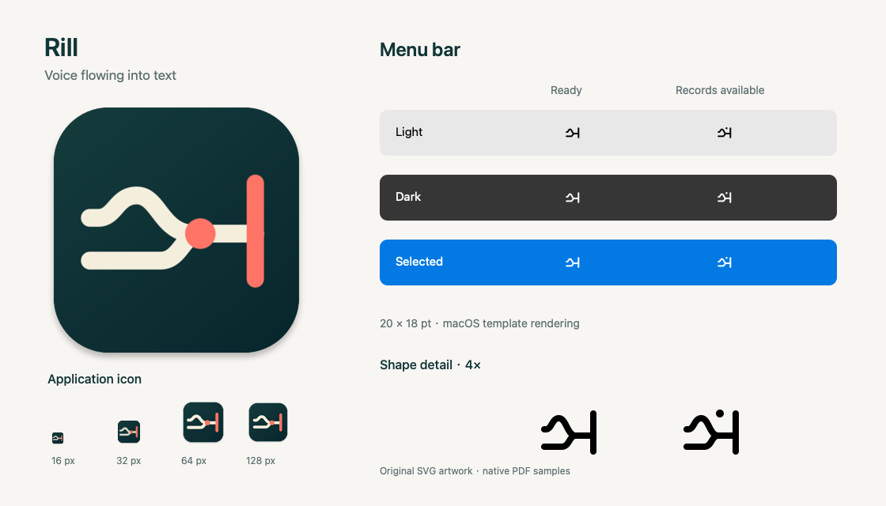

# 图标设计

Rill 的图标表达「语音汇入光标」：上方的波形代表语音，下方的通道代表可复用输入，
两者汇入同一节点，向右成为光标处的文字。应用图标与菜单栏图标保留相同轮廓，
分别适配 Dock 中的彩色图块和菜单栏中的单色小图形。

本文记录 [图标实现 PR #22](https://github.com/zrr1999/rill/pull/22) 中
[`6982d572bf4c` 版本][design-version] 的设计与预览。实现的合并状态以该 PR 为准；
收录设计文档不代表当前文档分支已经包含对应的 App 资源。



预览中的菜单栏样例由 AppKit / SwiftUI 渲染，标称尺寸为 20 × 18 pt；
网页缩放会改变显示大小，底部四倍放大图用于检查轮廓。

## 应用图标

应用图标采用原创 SVG，沿用既有「语音汇入光标」概念，移除细碎倒角和文字，
让识别依赖两条输入通道、汇合点与右侧光标。圆头笔画与连续曲线使语音和文字
读作同一条路径；珊瑚色仅用于汇合点与光标，标记从输入到文字输出的过程。

| 元素 | 颜色 | 用途 |
| --- | --- | --- |
| 深青背景 | `#153C3D` → `#08272D` | 为浅色线条提供稳定底色 |
| 暖白通道 | `#F4EEDC` | 上方语音波形与下方输入通道 |
| 珊瑚强调色 | `#FF7466` | 汇合节点与文本光标 |

源画布为 1024 × 1024，通道笔画宽 70，光标笔画宽 68，汇合节点半径 60。
这些比例保留了输入通道之间的空隙，并使节点在 16 px 图标中仍能与光标区分。
小尺寸验收关注轮廓和分离度，不依赖背景渐变或装饰细节。

SVG 导出的 PNG 是不透明方形。现有 ICNS 生成流程负责透明圆角、阴影和小尺寸
光学裁切，输出 16–1024 px 的传统 macOS 图标资源；不要把网页预览中的圆角图块
再次当作生成源，以免重复裁切和叠加阴影。

## 菜单栏图标

菜单栏版本在 20 × 18 的独立画布上重绘，使用 2 pt 圆头笔画。
它保留波形、下方通道和光标，去掉彩色汇合节点与背景图块，为小尺寸留出空隙。
导出为透明的单色矢量 PDF，由 macOS 的 template 渲染提供浅色、深色和选中时的颜色。

| 状态 | 显示 | 含义 |
| --- | --- | --- |
| 语音输入就绪 | 基础 Rill 轮廓 | 包括剪贴板采集关闭或暂停，但仍可使用语音输入的状态 |
| 采集开启且有可用记录 | 轮廓加一个小圆点 | 提示记录可用，不表示条数或未读数量 |
| 录音、处理、权限阻塞、启动检查及临时采集状态 | 现有 SF Symbols | 沿用原有状态优先级和反馈 |

记录提示点位于 SVG 的 `records-indicator` 元素，半径 1.25 pt。
基础版本隐藏该点，有记录版本由生成器样式表启用；两种图标共用一份矢量源。
状态判断仍由 `MenuBarSystemSymbolPolicy` 负责，图标适配层只替换就绪和有记录
两种图形，不改变录音、权限等状态的优先级。菜单标签继续使用应用名称供辅助功能读取。

## 源文件与维护

设计参数、源文件和导出产物对应上述固定版本；修改时以 SVG 为事实源，
受审 SHA-256 和生成细节统一维护在 [图标资源说明][asset-readme]，不在本文重复维护。

| 文件 | 职责 |
| --- | --- |
| [Rill.svg][app-svg] | 应用图标的可编辑矢量源 |
| [RillMenuBar.svg][menu-svg] | 菜单栏轮廓及可选记录提示点 |
| [render_brand_assets.sh][brand-generator] | 生成 1024 px PNG 和两种菜单栏 PDF |
| [render_app_icon_renditions.swift][icon-renderer] | 生成带圆角、阴影和光学调整的各尺寸图标 |
| [generate_app_icon.sh][icon-generator] | 校验受审 PNG 并装配 ICNS |

在包含该实现的 checkout 中，安装 `librsvg` 后重新导出：

```sh
brew install librsvg
scripts/render_brand_assets.sh
bash scripts/tests/app_icon_test.sh
scripts/swift_locked.sh test --filter RillMenuBarIconTests
```

常规构建使用提交的 PNG / PDF，无需安装 SVG 转换工具。源 SVG、导出文件、
资源说明与图标检查中的源图摘要应在同一提交中更新。本文预览是该版本的展示快照，
设计变化时应从新的导出产物重新渲染，并同步版本链接；预览图不是打包输入。

菜单栏 PDF 通过 `Bundle.module.image(forResource:)` 加载，再以 `NSImage`
交给 SwiftUI 做 template 渲染。松散 PDF 资源不能依赖 SwiftUI 的命名图片初始化器；
维护加载路径时应保留实际资源渲染测试，避免资源存在但菜单栏空白。

## 验收边界

资源检查覆盖 ICNS 尺寸、透明边界和小尺寸轮廓；菜单栏渲染测试覆盖包内 PDF 加载、
20 × 18 pt 尺寸和记录提示点的可见差异。上方预览展示了浅色、深色和选中配色。

发布前仍需在目标 macOS 上检查 Finder、Dock 与真实菜单栏显示、状态切换、
辅助功能名称和 VoiceOver 操作。预览及自动化测试不能代替这些交互验收，
步骤见 [发布验收清单](release-qa-checklist.md)。整体界面约定见 [UI 方向](ui-direction.md)。

[design-version]: https://github.com/zrr1999/rill/commit/6982d572bf4c349fca0401eb95dfda36f55927c8
[asset-readme]: https://github.com/zrr1999/rill/blob/6982d572bf4c349fca0401eb95dfda36f55927c8/Resources/AppIcon/README.md
[app-svg]: https://github.com/zrr1999/rill/blob/6982d572bf4c349fca0401eb95dfda36f55927c8/Resources/AppIcon/Rill.svg
[menu-svg]: https://github.com/zrr1999/rill/blob/6982d572bf4c349fca0401eb95dfda36f55927c8/Resources/AppIcon/RillMenuBar.svg
[brand-generator]: https://github.com/zrr1999/rill/blob/6982d572bf4c349fca0401eb95dfda36f55927c8/scripts/render_brand_assets.sh
[icon-renderer]: https://github.com/zrr1999/rill/blob/6982d572bf4c349fca0401eb95dfda36f55927c8/scripts/render_app_icon_renditions.swift
[icon-generator]: https://github.com/zrr1999/rill/blob/6982d572bf4c349fca0401eb95dfda36f55927c8/scripts/generate_app_icon.sh
